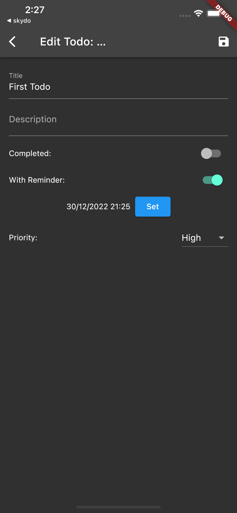

# SkyDo

A simple Todo app built in 2 different ways. One using SwiftUI and the other using Flutter.

## What is SkyDo?

SkyDo is a simple Todo app that allows you to add, edit, and delete tasks. It also allows you to mark tasks as complete and incomplete.
For the backend, I used Appwrite, a backend-as-a-service (Baas).

## Why did I build SkyDo?

I wanted to build a simple app that I could use to learn SwiftUI. I also wanted to build a Flutter version of the app to compare with the SwiftUI version.

## Coding duration

### SwiftUI

- 2 days

### Flutter

- 1 hour (As simple and fast as possible)

## Features

- Add, edit, and delete tasks
- Mark tasks as complete and incomplete
- Archive tasks
- Login

## Screenshots

|         | Login                                                                     | Home                                                                     | Edit Task                                                                |
| ------- | ------------------------------------------------------------------------- | ------------------------------------------------------------------------ | ------------------------------------------------------------------------ |
| SwiftUi |      |      |      |
| Flutter |  |  |  |

## [LICENSE](https://choosealicense.com/licenses/mit/)
